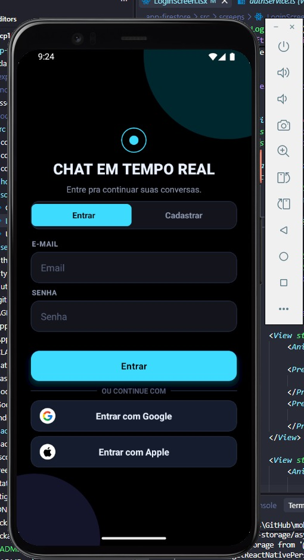
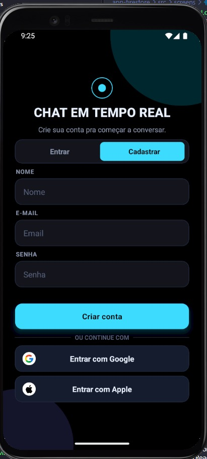
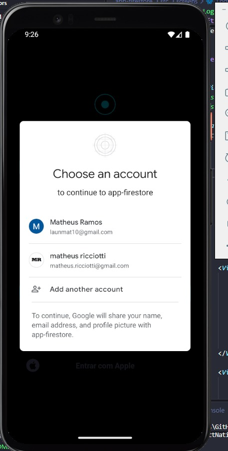
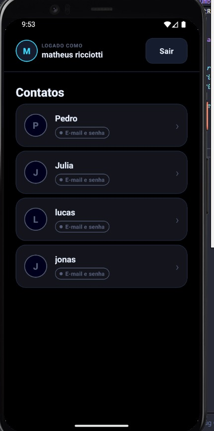
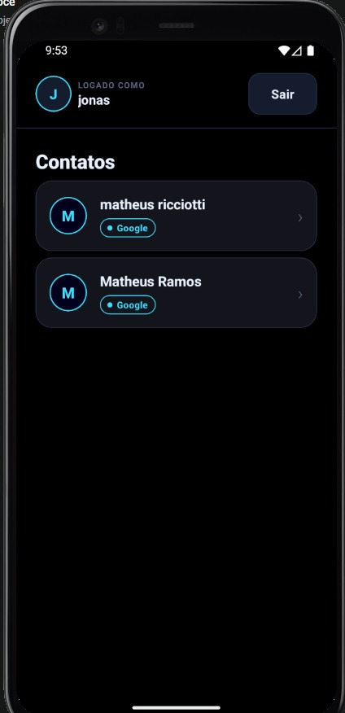
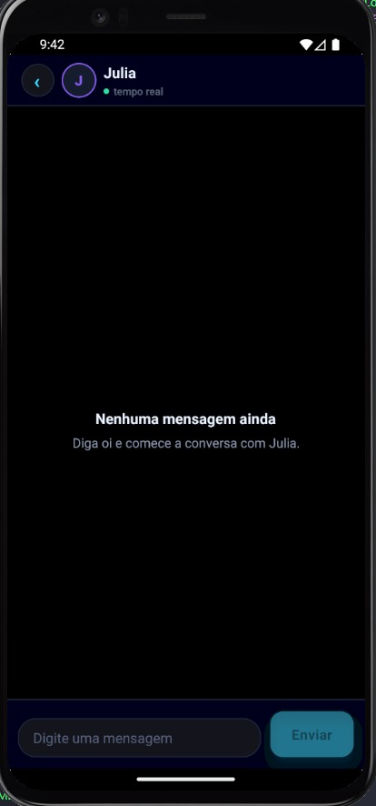
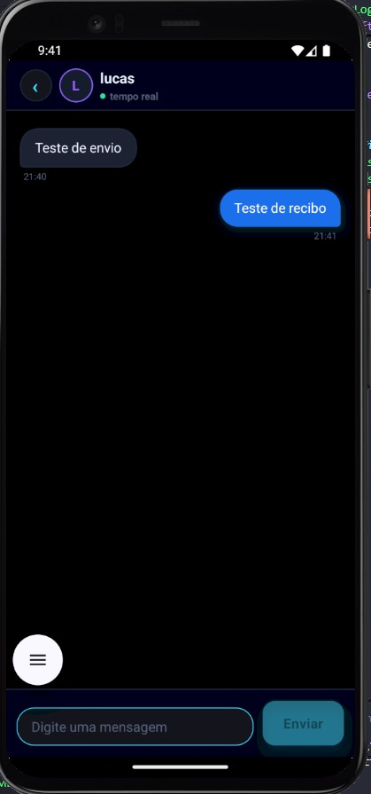
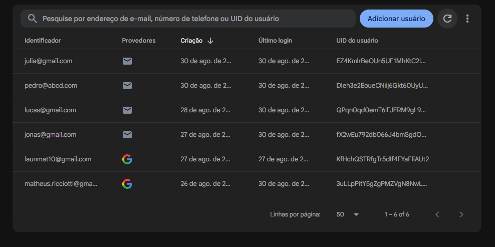
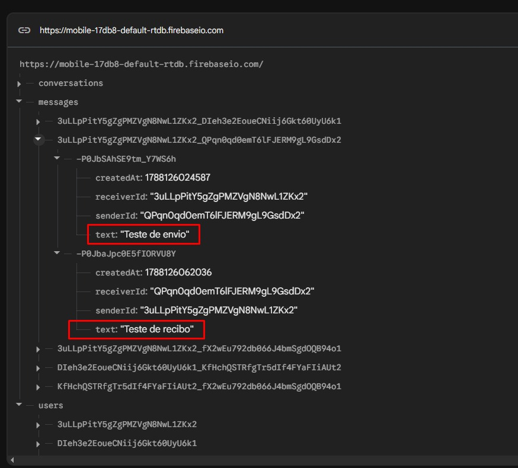
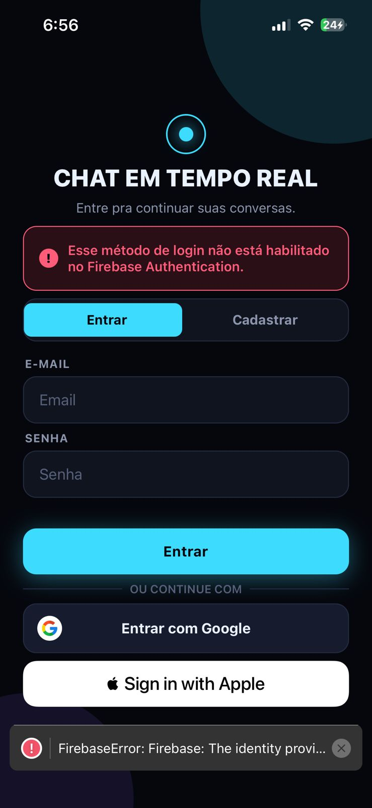

# Chat Firebase — CP1 Mobile Development & IoT

Aplicativo de chat 1 para 1 em React Native + TypeScript, com autenticação
por E-mail/Senha, Google e Apple via Firebase Authentication, e mensagens em
tempo real via Firebase Realtime Database.

## Integrantes

- RM554673 - Fernanda Rocha Menon
- RM556237 - Luiza Macena Dantas
- RM558537 - Luan Ramos Garcia de Souza
- RM556930 - Matheus Ricciotti
- RM555189 - Matheus Bortolotto

## Tecnologias utilizadas

- React Native
- Expo (SDK 55)
- TypeScript
- Firebase Authentication (e-mail/senha, Google, Apple)
- Firebase Realtime Database
- `@react-native-google-signin/google-signin`
- `expo-apple-authentication`
- EAS Build (development client, necessário para Google/Apple nativos)

## Serviços Firebase utilizados

- **Authentication**: cadastro/login por e-mail e senha, login com Google e
  login com Apple.
- **Realtime Database**: perfis de usuário (`users/{uid}`), conversas
  (`conversations/{conversationId}`) e mensagens
  (`messages/{conversationId}/{messageId}`), todos sincronizados em tempo
  real.

## Limitação conhecida: Apple Sign-In

O login com Apple está **implementado no código** (`loginWithApple` em
`src/services/authService.ts`, botão nativo em `LoginScreen.tsx`,
`usesAppleSignIn` configurado em `app.json`), seguindo a mesma lógica dos
demais provedores.

Porém, para o provedor Apple funcionar de ponta a ponta é necessário
habilitá-lo no Firebase Authentication, o que exige gerar um Services ID,
Team ID e uma chave privada no **Apple Developer Portal** — só acessível com
uma conta paga (Apple Developer Program, US$ 99/ano). Como este é um
projeto acadêmico, optamos por **não contratar essa conta**.

Na prática: o botão de login com Apple aparece normalmente em dispositivos
iOS, mas ao tentar entrar o Firebase retorna o erro "esse método de login
não está habilitado" — comportamento esperado e já tratado na tela de login,
não um bug.

## Regra de comunicação entre provedores

Um usuário só pode conversar com alguém que entrou por um método diferente
de "família":

- E-mail/Senha ↔ Google
- E-mail/Senha ↔ Apple
- Google ↔ Google, Apple ↔ Apple e Google ↔ Apple **não são permitidos**

Essa regra está implementada em
[`app-firestore/src/utils/chatRules.ts`](app-firestore/src/utils/chatRules.ts)
e é aplicada na tela de contatos
([`UsersScreen.tsx`](app-firestore/src/screens/UsersScreen.tsx)), que só
lista pessoas compatíveis com o provedor do usuário logado.

## Estrutura do projeto

```text
app-firestore/
  App.tsx
  app.json
  eas.json
  database.rules.json
  plugins/
    withGradleMemoryFix.js  # config plugin: ajusta memória do Gradle no build EAS
  src/
    components/    # Loading, ErrorMessage, UserItem, ChatMessage, ChatInput,
                   # Button, TextField, SocialButton, BrandMarks (Google/Apple)
    contexts/       # AuthContext (estado de autenticação global)
    hooks/          # useAuth, useChat
    screens/        # LoginScreen, UsersScreen, ChatScreen
    services/       # authService, userService, chatService (Firebase)
    types/          # ChatUser/AuthProvider, Conversation/ChatMessage
    utils/          # chatRules (regra de compatibilidade entre provedores)
    config/         # firebase.ts (inicialização do Firebase)
    theme/          # theme.ts (cores, espaçamentos, raios usados nos estilos)
```

## Configuração do Firebase
 O que já está configurado nesse projeto:

- **Realtime Database** criado, com as regras de segurança de
  `database.rules.json` publicadas (só participantes autenticados de cada
  conversa leem/escrevem nela).
- **Authentication** com e-mail/senha e Google habilitados (Apple seguiria o
  mesmo caminho — ver limitação documentada acima).
- Apps **Android** e **iOS** registrados no projeto, necessários pros
  módulos nativos de login (`google-services.json`/`GoogleService-Info.plist`
  na raiz de `app-firestore/`).

## Como executar

Pré-requisitos: Node.js LTS e, para testar Google/Apple de verdade, uma
conta Expo/EAS gratuita e um development build gerado via EAS.

```bash
cd app-firestore
npm install

# Login por e-mail/senha funciona direto no Expo Go:
npx expo start

# Google e Apple Sign-In exigem um development build (não funcionam no
# Expo Go, pois usam módulos nativos):
eas build --profile development --platform android
# depois de instalar o build gerado no dispositivo:
npx expo start --dev-client
```

## Estados tratados na interface

- Carregando (login, envio de mensagens, lista de contatos)
- Erros de autenticação, cadastro, Google/Apple Sign-In e leitura/escrita no
  Realtime Database
- Usuário não autenticado (tela de login)
- Nenhum contato disponível para conversar
- Conversa sem mensagens
- Falha no envio de mensagem

## Prints da aplicação

**Login e cadastro**

| Login | Cadastro |
|---|---|
|  |  |

**Google Sign-In (nativo)**



**Regra de comunicação entre provedores** — cada lado só vê o provedor compatível:

| Contatos vistos por uma conta Google | Contatos vistos por uma conta e-mail/senha |
|---|---|
|  |  |

**Chat em tempo real**

| Sem mensagens (estado vazio) | Com mensagens (enviada/recebida) |
|---|---|
|  |  |

**Dados reais no console do Firebase** — prova de que não há usuário hardcoded nem mensagem simulada:

| Usuários reais no Firebase Authentication | Mensagens reais no Realtime Database |
|---|---|
|  |  |

**Apple Sign-In** — prompt nativo funcionando e erro tratado corretamente (ver [limitação documentada acima](#limitação-conhecida-apple-sign-in)):

| Prompt nativo do iOS | Erro tratado (provedor não habilitado no Firebase) |
|---|---|
|  |  |
